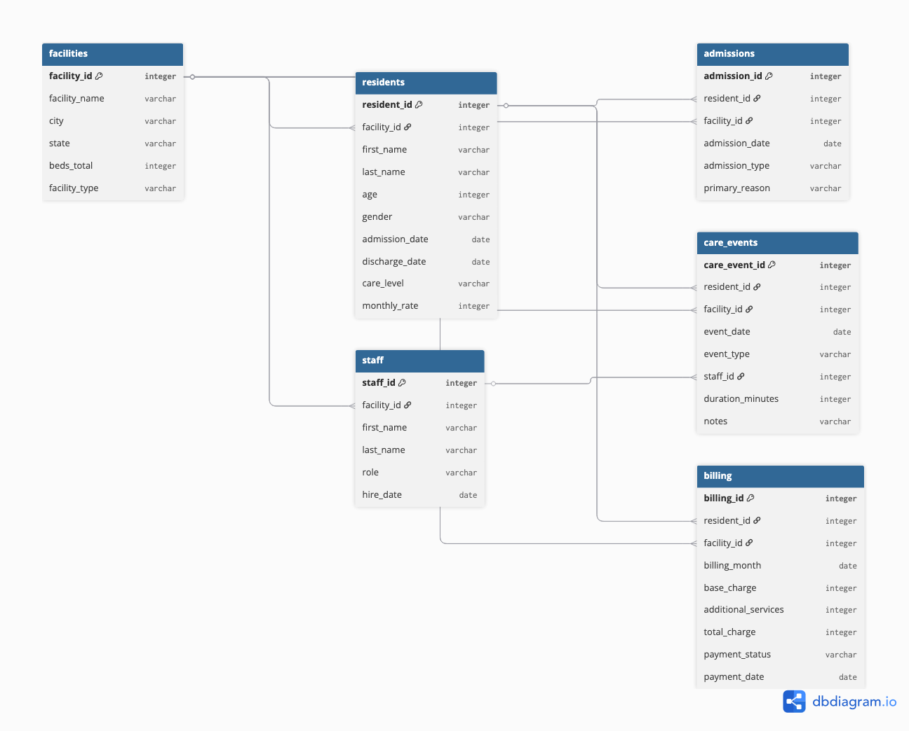

# sql_practice — LCS Senior Living Data

My background is in agricultural research: multi-source datasets, quality control pipelines, and communicating findings across a wide audience. This project is a deliberate translation of those skills into the tools and patterns used in data engineering — SQL, Python, and DuckDB — using a domain I find genuinely interesting: operational data from senior living facilities.

The dataset is synthetic but modeled after real operational complexity. Six tables, realistic foreign key relationships, and the kinds of messy questions that show up in actual analysis: who are the highest-acuity residents? which care staff carry the heaviest load? what does revenue look like for residents approaching discharge?

---

## Schema



Five operational entities feed into three transaction tables:

**`facilities`** is the anchor. Every resident, staff member, and operational record ties back to a facility. This mirrors real senior living operations, where a management company oversees multiple sites with different types and capacities.

**`residents`** holds demographic and admission data. `care_level` and `monthly_rate` make this the primary driver for complexity and revenue analysis.

**`staff`** tracks employees by role and hire date within a facility. The `staff_id` flows into `care_events`, which is where workload analysis lives.

**`admissions`** records each facility admission with type and primary reason — a bridge table that supports tracking residents across multiple admissions or facility transfers.

**`care_events`** is the most granular table: one row per care interaction (medication, assessment, activity), with the delivering staff member and duration. This is where window functions earn their keep.

**`billing`** captures monthly charges per resident, broken into base and additional service fees, with payment status and date.

---

## Generating the data

```bash
python generate_lcs_data.py
duckdb lcs_data.duckdb < load_lcs.data.sql
```

`generate_lcs_data.py` builds a one-year synthetic dataset: 5 facilities, 150 residents, 40 staff, with a ~15% discharge rate to simulate realistic turnover. `load_lcs.data.sql` ingests the CSVs into a `raw` schema in DuckDB using `read_csv_auto()`.

---

## SQL exercises

### Exercise 1 — Window functions (`01_window_functions.sql`)

Identifies longest-tenured residents using `ROW_NUMBER()`, `RANK()`, and `LAG()` across admission dates, with cumulative aggregations for tenure and billing totals. The R equivalent is in `01_window_window_functions.r`.

### Exercise 2 — Ranking care load (`02_rank_care_events.sql`)

Ranks residents by total care events using `DENSE_RANK()` over aggregated counts. Surfaces which residents require the most staff time — useful for staffing and acuity modeling. See `02_rank_care_events.r` for the dplyr translation.

### Exercise 3 — Chained CTEs (`03_ctes.sql`)

A multi-step CTE chain that computes care frequency, length of stay, a composite complexity score, and billing summaries in sequence — then joins them into a single ranked output of high-complexity, high-revenue residents. Output is in `03_ctes_output.md`. The R version is `03_ctes.r`.

---

## R-to-SQL comparison (`R_to_SQL.QMD`)

A Quarto document placing dplyr and SQL side by side for the same analytical questions. The goal was to make the translation explicit — not just "here's the SQL" but "here's the dplyr I already know how to write, and here's the SQL that does the same thing." Rendered to `R_to_SQL.html`.

---

## CMS provider data pipeline (`ingest.py`)

A Python ingestion script that queries the [CMS Provider Data API](https://data.cms.gov/provider-data) — the public dataset for nursing home and senior living providers.

Key design decisions:
- **Class-based client** (`CMSProviderAPIClient`) with a persistent session and configurable batch size and timeout
- **Paginated fetch** using SQL `LIMIT`/`OFFSET` queries against the DKAN SQL endpoint — handles large result sets without memory issues
- **Schema validation** on the returned DataFrame: checks for empty results and flags any column exceeding 90% null values before writing to disk
- **Structured logging** at INFO level so pipeline progress is visible without print statements

Output lands in `data/cms_provider_data.csv`.

```bash
python ingest.py
```

This was the first pipeline I built that felt like something you'd actually maintain — a real class with documented behavior, logging, and a validation step before the write.

---

## Files

| File | Description |
|------|-------------|
| `generate_lcs_data.py` | Synthetic dataset generation |
| `load_lcs.data.sql` | DuckDB CSV ingestion script |
| `lcs_data.duckdb` | Populated DuckDB database |
| `01_window_functions.sql` / `.r` | Window function queries + R equivalent |
| `02_rank_care_events.sql` / `.r` | Care load ranking + R equivalent |
| `03_ctes.sql` / `.r` | Chained CTE analysis + R equivalent |
| `03_ctes_output.md` | Query results |
| `R_to_SQL.QMD` / `.html` | Side-by-side language comparison |
| `ingest.py` | CMS provider API pipeline |
| `er_diagram.png` | Schema entity relationship diagram |
| `data/raw/` | Source CSVs (facilities, residents, staff, admissions, care_events, billing) |
| `data/cms_provider_data.csv` | CMS API output |
